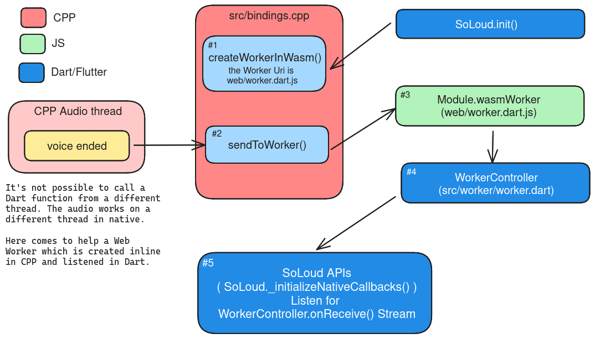

# Web Notes


## Description

The web platform is now supported, but some testing is welcome.

## How to use

To add the plugin to a web app, add the following line to the `<body>` section of `web/index.html`:
```
<script src="assets/packages/flutter_soloud/web/libflutter_soloud_plugin.js" defer></script>
```

---

**`loadUrl()`** may produce the following error when the app is run:
>> Cross-Origin Request Blocked: The Same Origin Policy disallows reading the remote resource at https://www.learningcontainer.com/wp-content/uploads/2020/02/Kalimba.mp3. (Reason: CORS header ‘Access-Control-Allow-Origin’ missing). Status code: 200.

This is due for the default beavior of http servers which don't allow to make requests outside their domain. Refer [here](https://enable-cors.org/server.html) to learn how to enable your server to handle this situation.
Instead, if you run the app locally, you could run the app with something like the following command:
```
flutter run -d chrome --web-renderer canvaskit --web-browser-flag '--disable-web-security' -t lib/main.dart --release
```

---

***It is not possible to read a local audio file directly*** on the web. For this reason, `loadMem()` has been added, which requires the `Uint8List` byte buffer of the audio file.
***IMPORTANT***: `loadMem()` with mode `LoadMode.memory` used on web platform will freeze the UI for the time needed to decompress the audio file. Please use it with mode `LoadMode.disk` or load your sound when the app starts.

## For developers

In the `web` directory, there is a `compile_wasm.sh` script that generates the `.js` and `.wasm` files for the native C code located in the `src` dir. Run it after installing *emscripten*. There is also a `compile_web.sh` to compile the web worker needed by native code to communicate with Dart. The generated files are already provided, but if it is needed to modify C/C++ code or the `web/worker.dart` code, the scripts must be run to reflect the changes.

The `compile_wasm.sh` script uses the `-O3` code optimization flag.
To see a better errors logs, use `-O0 -g -s ASSERTIONS=1` in `compile_wasm.sh`.

---

The `AudioIsolate` [has been removed](https://github.com/alnitak/flutter_soloud/pull/89) and all the logic has been implemented natively. Events like `voice ended` are sent from C back to Dart. However, since it is not possible to call Dart from a native thread (the audio thread), a new web worker is created using the WASM `EM_ASM` directive. This allows sending the `voice ended` event back to Dart via the worker.

Here a sketch to show the step used:


**#1.** This function is called while initializing the player with `FlutterSoLoudWeb.setDartEventCallbacks()`.
It creates a Web Worker in the [WASM Module](https://emscripten.org/docs/api_reference/module.html) using the compiled `web/worker.dart`. After calling this, the WASM Module will have a new variable called `Module.wasmWorker` which will be used in Dart to receive messages.
By doing this it will be easy to use the Worker to send messages from within the CPP code.

**#2.** This function, like #1, uses [EM_ASM](https://emscripten.org/docs/porting/connecting_cpp_and_javascript/Interacting-with-code.html#interacting-with-code-call-javascript-from-native) to inline JS. This JS code uses the `Module.wasmWorker` created in #1 to send a message.

**#3.** This is the JS used and created in #1. Every messages sent by #2 are managed here and sent to #4.

**#4.** Here when the event message has been received, a new event is added to a Stream. This Stream is listened by the SoLoud API.

**#5.** Here we listen to the event messages coming from the `WorkerController` stream. Currently, only the "voice ended" event is supported. The Stream is listened in `SoLoud._initializeNativeCallbacks()`.
